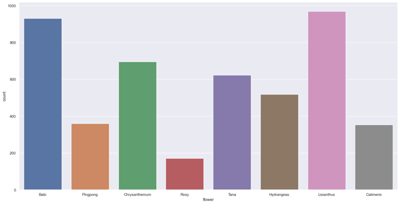
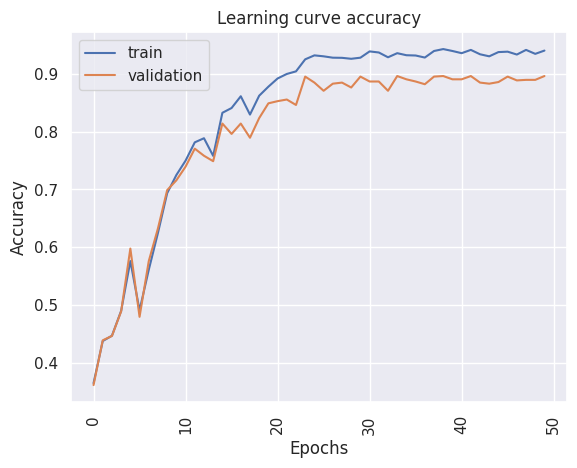
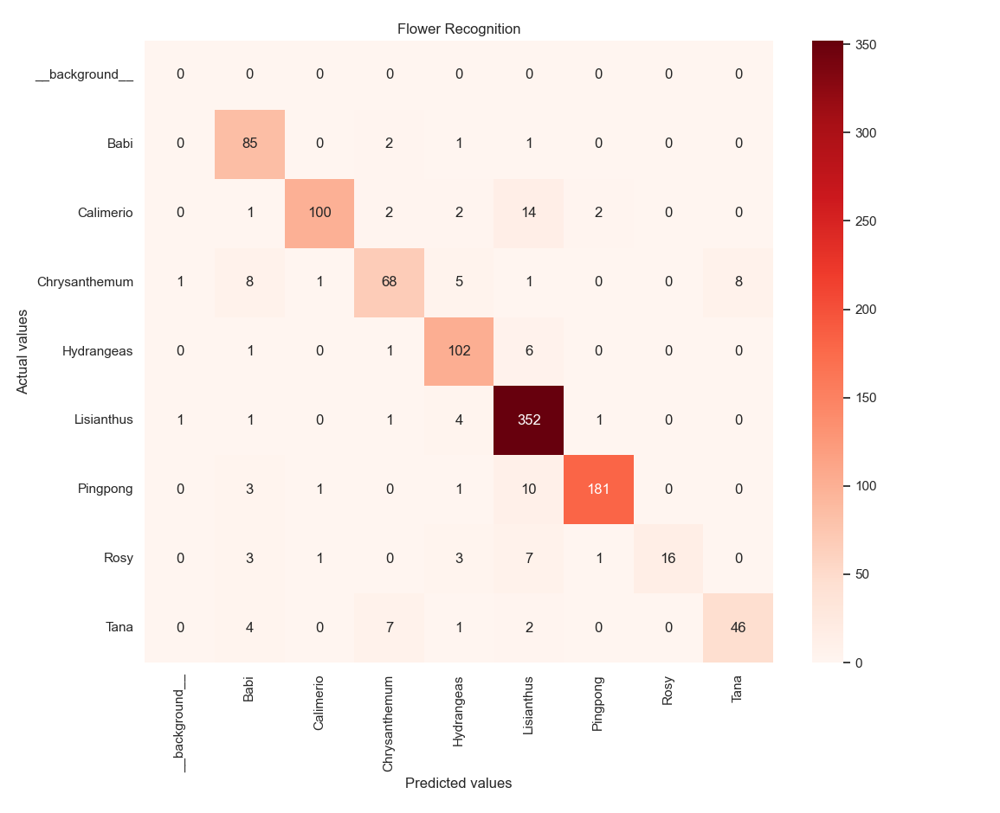
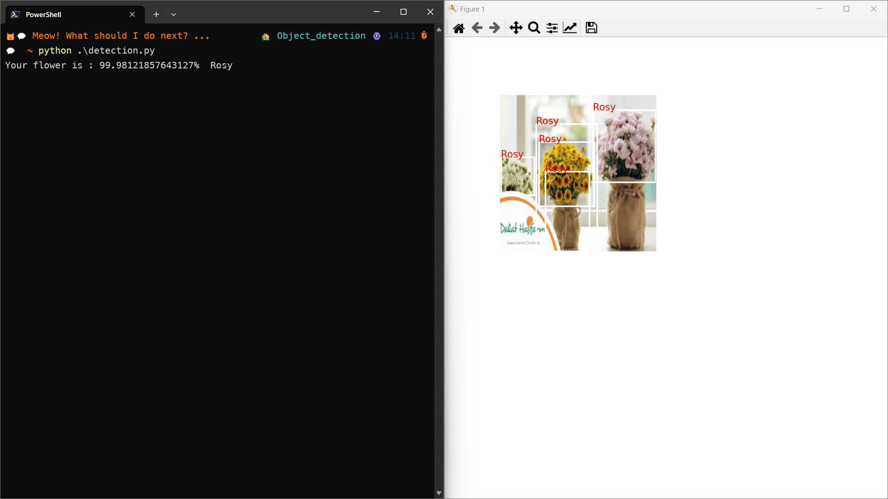

# Object detection model for classify image

___

## Introduction

This model is train the object detection model for classifying the type of the flower and using the pytorch FasterRCNN
v2 without pretrained model. The model is trained
in [the flower dataset](https://rmiteduau-my.sharepoint.com/:f:/g/personal/s3891968_rmit_edu_vn/EsbDJatwVG5GtL_5KdDVa2cBdqNSGJrO5Jmv21VuYZSiAw?e=EEvXvx)
which has 8 difference type of flower and
using [The Pascal VOC format](https://www.section.io/engineering-education/understanding-pascal-voc-dataset/)
for labeling the object detection labels.

**Distribution of a dataset**


## Setting up

1. Checking the data folder to ensure you have the dataset (for more information, see in the README.md of the data folder)
2. The dataset must have the metadata as same as with the format in the model metadata (If you have the custom data of
   the flower directory please change the path in the metadata suitable)
3. Install the pytorch (more information: [PyTorch](https://pytorch.org/))
4. Run the pip install ```pip install -r requirements.txt``` for install the requirements .txt
5. Before running the file you must be config the setting of the model in the ***config.py***
6. When everything is already you can run the script in the python by ```python file name```
7. For viewing the dataset you can run ```python dataset.py```
8. For training the model you can run ```python train.py```

## Model metadata

Based on the flower dataset, we also converted the labeled dataset into the metadata for training the model

|     flower     |        path        |  x1  |  y1  |  x2  |  y2  |
|:--------------:|:------------------:|:----:|:----:|:----:|:----:|
| Type of flower | Path of the flower | xmin | ymin | xmax | ymax |

- The train dataset :  [Training data](../data/meta_data/train/train.csv)
- The validation dataset: [Validation data](../data/meta_data/val/val.csv)

## Model architecture


- Faster R-RCNN combines deep learning with region proposal methods to achieve accurate and efficient object detection
  in images. The Faster R-CNN architecture consists of two main components: a region proposal network (RPN) and a
  detection network. The RPN generates potential object bounding box proposals by examining different regions of an
  input image. These proposals are then fed into the detection network for classification and refinement. A localized
  region image classification will result in a more consistence result as experimented from model 1 and model 2.
- In order to train a Faster-RCNN model, our team has preprocessed flower image dataset. We went through the data set
  and manually label, draw object bounding boxes for each of them. These images with metadata are then feed into our
  Faster R-CNN model, implemented with PyTorch.
- The backbone of our model is ResNet V2. The backbone CNN model is used to extract features from images. ResNet V2
  is a residual CNN. The reason why we chose ResNet with FPN is that residual network can retain information from early
  CNN layer, less feature are loss as they are processed. The result of the backbone model is a 13 * 13 * 256 tensor
  feature map.
- The feature map is then feed to Region Proposal Network (RPN) and Region of Interest Pooling (ROI Pooling) layer.
  Results from these two layers are then used as input for fully connected neural network. The result is the bounding
  box regression with the object classification probability of each class.
- This model produces an exceptional result on training dataset: up to ~93% accuracy on training data set and ~90%
  accuracy on testing dataset. This classification accuracy result is traded off with many hours of computational
  powers.

## Model

The model have been training into 50 epochs and the model was saved into the output model path. Because of the
limitation, you can go the link below to see the checkpoint and the final model <br>
Link: [Model and check point](https://rmiteduau-my.sharepoint.com/:f:/g/personal/s3891968_rmit_edu_vn/ErJWG0X1fJVMhJK2EyDI2BIBkNQQraIrpacfQhPKVzOBTQ?e=z5Mip1)

## Metric

### Learning curve



- The performance of the learning curve is good fitting with the train and the validation increases together

### Classification report and confusion matrix


- Note: Classification report
    - 0: Background / Unknown
    - 1: Babi
    - 2: Calimerio
    - 3: Chrysanthemum
    - 4: Hydrangeas
    - 5: Lisianthus
    - 6: Pingpong
    - 7: Rosy
    - 8: Tana


In the classification report and the confusion matrix show that the Calimerio flower can wrong detected with the
Lisianthus
flower. Moreover, Rosy flower can easily wrong classification to the Lisianthus. However, the Lisianthus can easily
detection. Overall, allmost all the flower have the highly correctly classification the type of the image
___

# Detection example
- Run the ```python detection```
- ***Notice***
  - User must be change the path of model and the flower image in the file [detection.py](./detection.py)

## Result
- The result will appear in the screen and the terminal have the result type of flower



